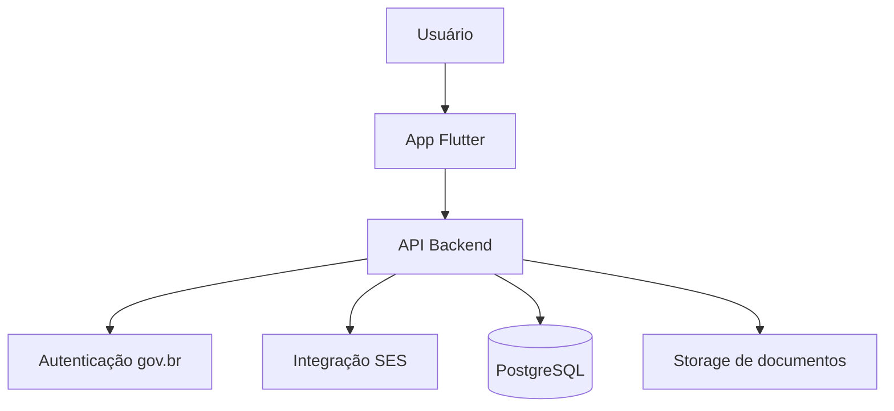

# MinhaFila Saúde

Aplicativo Flutter focado em **transparência de filas do SUS**, com autenticação via **gov.br**, acompanhamento da posição na fila, histórico de movimentações, notificações e fluxo de confirmação de procedimento com envio de evidência para validação pela **SES**.

> Projeto desenvolvido como base para **TCC/MVP governamental**, priorizando usabilidade, transparência de informações, organização arquitetural, acessibilidade e evolução futura para integração real com sistemas públicos de saúde.

---

## Visão geral

O **MinhaFila Saúde** foi concebido para permitir que o cidadão acompanhe, de forma simples, segura e acessível, a sua posição em filas de atendimento do SUS. Além disso, o sistema propõe um mecanismo colaborativo de atualização da fila, permitindo que o usuário informe quando já realizou determinado procedimento por outro canal, contribuindo para maior eficiência da gestão pública.

### Principais objetivos da solução

- aumentar a transparência das filas de atendimento;
- melhorar a experiência do cidadão no acompanhamento da solicitação;
- reduzir inconsistências na fila causadas por registros desatualizados;
- apoiar a SES com um fluxo digital de validação e atualização da fila;
- oferecer recursos de acessibilidade para usuários com diferentes perfis de uso;
- preparar uma base técnica robusta para evolução acadêmica e produtiva.

---

## Funcionalidades implementadas

- Tela de boas-vindas com acesso via **gov.br**
- Login configurável:
  - **modo mock** por padrão, para demonstração e testes
  - estrutura preparada para integração real com **gov.br**
- Dashboard principal com:
  - saudação personalizada
  - card da fila ativa
  - posição atual em destaque
  - estimativa de espera em formato textual mais claro
  - alerta de variabilidade da posição conforme critérios de regulação
  - barra de progresso
  - status da solicitação
- Estrutura preparada para exibir **mais de uma solicitação**
- Fluxo de confirmação:
  - “Sim, já realizei”
  - “Não, continuo na fila”
- Fluxo de validação com anexo:
  - captura de foto do laudo
  - seleção de PDF
  - envio para validação
- Tela de status do processo
- Histórico de movimentações
- Central de notificações
- Tela de ajustes e informações do ambiente
- Exibição de **último acesso na sessão atual**
- Testes básicos de domínio e widget
- Pipeline inicial de CI com GitHub Actions

---

## Acessibilidade implementada

A solução vem sendo evoluída com foco em inclusão digital e acessibilidade prática.

### Recursos já disponíveis

- **Leitura por áudio da posição da fila**
  - botão manual **“Ouvir posição”**
  - opção de leitura automática ao abrir a tela principal
- **Leitura por áudio do histórico**
  - botão dedicado em cada card do histórico
- **Leitura por áudio das notificações**
  - botão dedicado em cada card de aviso
- **Ajuste de velocidade da fala**
- **Modo de alto contraste**
- **Ajuste de tamanho do texto**
- **Modo daltônico**
  - revisão da paleta para melhorar distinção entre status, avisos e informações
- reforço visual para que elementos importantes não dependam somente de cor

### Direção de evolução

O projeto também está sendo orientado por critérios de acessibilidade digital compatíveis com:
- **WCAG 2.2**
- **ABNT NBR 17225**
- princípios aplicáveis à acessibilidade em aplicativos móveis

---

## Demonstração do fluxo

### Login
Na versão atual, o projeto utiliza **autenticação mockada por padrão** para facilitar testes e apresentações. Ao tocar no botão **“Entrar com gov.br”**, o app realiza uma autenticação simulada e direciona o usuário ao dashboard.

### Dashboard
Após o login, o usuário visualiza:
- procedimento em fila;
- posição atual;
- estimativa de espera;
- status do processo;
- histórico e notificações;
- recursos de acessibilidade configuráveis.

### Atualização da fila
Ao tocar no card principal, o cidadão pode:
- informar que **continua aguardando**;
- ou informar que **já realizou o procedimento**, anexando um documento comprobatório para validação.

### Validação
O sistema registra a solicitação e muda o status para **“Em validação pela SES”**, simulando o fluxo que futuramente será integrado ao backend institucional.

---

## Arquitetura da solução

A aplicação foi estruturada com foco em **escalabilidade, testabilidade, acessibilidade e separação de responsabilidades**.

### App mobile
- **Flutter**
- **Dart**
- **Material Design 3**
- **Riverpod** para gerenciamento de estado e injeção de dependências
- **go_router** para navegação declarativa
- **Repository Pattern** para desacoplamento entre UI e fonte de dados

### Backend proposto
Embora esta entrega esteja focada no app Flutter, a arquitetura da solução considera um backend intermediário responsável por:
- validação da autenticação via gov.br;
- consumo seguro da API da SES;
- regras de negócio de fila;
- recebimento de anexos;
- auditoria;
- envio de notificações.

### Banco de dados e armazenamento
Na arquitetura proposta:
- **PostgreSQL** armazenaria os dados estruturados da aplicação;
- **MinIO** ou **Amazon S3** armazenariam os documentos enviados pelo usuário;
- o app não acessaria diretamente os sistemas da SES, mas consumiria uma API intermediária segura.

---

## Diagrama de arquitetura



---

## Estrutura do projeto

```text
lib/
├── app/
│   ├── router/
│   └── theme/
├── core/
│   ├── extensions/
│   ├── services/
│   └── widgets/
├── features/
│   ├── auth/
│   └── home/
```

### Organização adotada
- separação por **feature**
- camadas de **domain**, **data** e **presentation**
- controllers com **Riverpod**
- widgets reutilizáveis
- serviços específicos para áudio, anexos e utilidades

---

## Como executar o projeto

### Pré-requisitos
- Flutter SDK instalado
- Dart SDK
- Xcode (para iOS)
- Android Studio / SDK Android (para Android)

### Instalação
```bash
flutter pub get
flutter run
```

### Análise e testes
```bash
flutter analyze
flutter test
```

---

## Observações para iOS

Para o fluxo de captura de foto do laudo funcionar corretamente no iOS, o projeto precisa conter as permissões adequadas no `Info.plist`, como:

- `NSCameraUsageDescription`
- `NSPhotoLibraryUsageDescription`

Sem essas chaves, o sistema pode encerrar o app ao tentar acessar a câmera.

---

## Estado atual do projeto

Atualmente, o projeto está em estágio de **prova de conceito funcional**, com:
- autenticação mockada;
- dados simulados para demonstração;
- fluxo de fila e validação funcional;
- camada inicial de acessibilidade já disponível na interface;
- base preparada para evolução incremental.

---

## Próximas evoluções sugeridas

- persistência local das preferências de acessibilidade;
- histórico persistente de último login;
- onboarding de acessibilidade na primeira abertura;
- integração real com backend e SES;
- painel administrativo para analistas;
- formulário de avaliação pós-confirmação do procedimento;
- conteúdos de ajuda com Libras;
- indicadores gerenciais e modelos preditivos de tempo de atendimento.

---

## Propósito acadêmico

Este projeto foi desenvolvido com foco em **TCC**, podendo ser utilizado como:
- prova de conceito de aplicativo governamental;
- base para discussão sobre transparência de filas públicas;
- estudo aplicado de arquitetura Flutter com acessibilidade;
- proposta evolutiva para integração com sistemas de saúde pública.

---

## Licença

Defina aqui a licença do projeto conforme a estratégia adotada no repositório.
