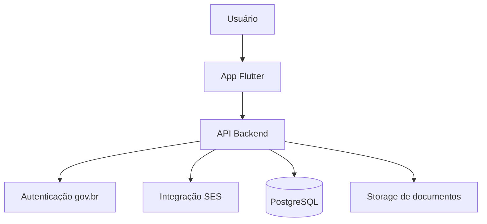
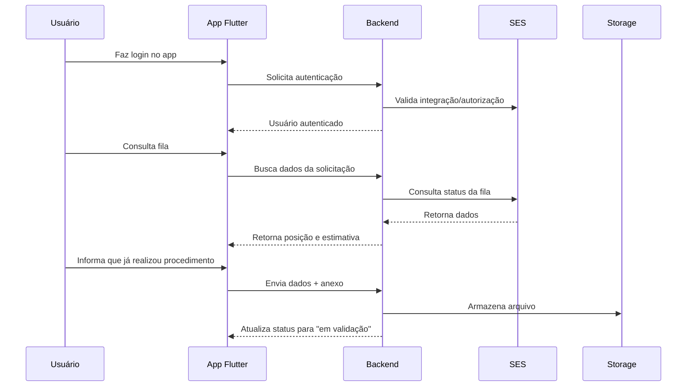

# MinhaFila Saúde

Aplicativo Flutter focado em **transparência de filas do SUS**, com autenticação via **gov.br**, acompanhamento da posição na fila, histórico de movimentações e fluxo de confirmação de procedimento com envio de evidência para validação pela **SES**.

> Projeto desenvolvido como base para **TCC/MVP governamental**, priorizando usabilidade, transparência de informações, organização arquitetural, acessibilidade e evolução futura para integração real com sistemas públicos de saúde.

---

## Visão geral

O **MinhaFila Saúde** foi concebido para permitir que o cidadão acompanhe, de forma simples, segura e acessível, a sua posição em filas de atendimento do SUS. Além disso, o sistema propõe um mecanismo colaborativo de atualização da fila, permitindo que o usuário informe quando já realizou determinado procedimento por outro canal, contribuindo para maior eficiência da gestão pública.

### Principais objetivos da solução

- aumentar a transparência das filas de atendimento;
- melhorar a experiência do cidadão no acompanhamento da solicitação;
- reduzir inconsistências na fila causadas por registros desatualizados;
- apoiar a SES com um fluxo digital de validação e atualização da fila;
- oferecer acessibilidade para usuários com dificuldade de leitura, limitação visual e necessidades de personalização da interface;
- preparar uma base técnica robusta para evolução acadêmica e produtiva.

---

## Funcionalidades implementadas

- Tela de boas-vindas com acesso via **gov.br**
- Login configurável:
  - **modo mock** por padrão, para demonstração e testes
  - estrutura preparada para integração real com **gov.br**
- Dashboard principal com:
  - saudação personalizada
  - suporte a **múltiplas solicitações por usuário**
  - card da fila ativa
  - posição atual em destaque
  - estimativa de espera em linguagem mais clara
  - barra de progresso
  - status da solicitação
- Fluxo de confirmação:
  - “Sim, já realizei”
  - “Não, continuo na fila”
- Fluxo de validação com anexo:
  - captura de foto do laudo
  - seleção de PDF
  - envio para validação
- Tela de status do processo
- Histórico de movimentações
- Central de notificações
- Tela de ajustes e informações do ambiente
- Recurso de **acessibilidade por áudio**
- Leitura manual da posição na fila com botão **“Ouvir posição”**
- Leitura por áudio no **histórico**
- Leitura por áudio nas **notificações**
- Opção de leitura automática ao abrir a tela principal
- Ajuste de velocidade da fala
- **Alto contraste**
- **Modo daltônico**
- **Ajuste global de tamanho de texto**
- Exibição de **último acesso na sessão**
- **Persistência local** das preferências de acessibilidade
- **Onboarding inicial de acessibilidade**
- Onboarding com **áudio orientativo**, inclusive para usuários com dificuldade de leitura
- Testes básicos de domínio e widget
- Pipeline inicial de CI com GitHub Actions

---

## Demonstração do fluxo

### Login

Na versão atual, o projeto utiliza **autenticação mockada por padrão** para facilitar testes e apresentações. Ao tocar no botão **“Entrar com gov.br”**, o app realiza uma autenticação simulada e direciona o usuário ao dashboard.

### Dashboard

Após o login, o usuário visualiza:

- procedimentos em fila;
- posição atual;
- estimativa de espera;
- observação de que a posição pode variar conforme prioridade clínica e regulação;
- progresso visual;
- histórico e notificações.

### Atualização da fila

Ao tocar no card principal, o cidadão pode:

- informar que **continua aguardando**;
- ou informar que **já realizou o procedimento**, anexando um documento comprobatório para validação.

### Validação

O sistema registra a solicitação e muda o status para **“Em validação pela SES”**, simulando o fluxo que futuramente será integrado ao backend institucional.

### Acessibilidade por áudio

O aplicativo oferece suporte inicial a usuários com baixa alfabetização ou dificuldade de leitura. Atualmente, o conteúdo pode ser lido em voz alta em diferentes pontos do sistema:

- posição da fila;
- histórico;
- notificações;
- onboarding inicial de acessibilidade.

### Preferências de acessibilidade

As preferências de acessibilidade podem ser configuradas pelo usuário e ficam salvas localmente no dispositivo. Entre elas:

- leitura automática da fila;
- velocidade da fala;
- alto contraste;
- modo daltônico;
- escala do texto.

---

## Arquitetura da solução

A aplicação foi estruturada com foco em **escalabilidade, testabilidade, acessibilidade e separação de responsabilidades**.

### App mobile

- **Flutter**
- **Dart**
- **Material Design 3**
- **Riverpod** para gerenciamento de estado e injeção de dependências
- **go_router** para navegação declarativa
- **Repository Pattern** para desacoplamento entre UI e fonte de dados

### Backend proposto

Embora esta entrega esteja focada no app Flutter, a arquitetura da solução considera um backend intermediário responsável por:

- validação da autenticação via gov.br;
- consumo seguro da API da SES;
- regras de negócio de fila;
- recebimento de anexos;
- auditoria;
- envio de notificações.

### Banco de dados e armazenamento

Na arquitetura proposta:

- **PostgreSQL** armazenaria os dados estruturados da aplicação;
- **MinIO** ou **Amazon S3** armazenariam os documentos enviados pelo usuário;
- o app não acessaria diretamente os sistemas da SES, mas consumiria uma API intermediária segura.

---

## Diagrama de arquitetura



---

## Fluxo de dados



---

## Estrutura de pastas

```text
lib/
  app/
    config/
    router/
    theme/
  core/
    extensions/
    services/
    widgets/
  features/
    auth/
      data/
      domain/
      presentation/
    home/
      data/
      domain/
      presentation/
    settings/
      presentation/
docs/
test/
.github/
  workflows/
assets/
  icons/
```

---

## Padrões e decisões técnicas

### Organização por feature

O projeto foi organizado por **feature**, facilitando manutenção, evolução e escalabilidade.

### Separação por camadas

Cada feature foi dividida em:

- **data**: fontes de dados e repositórios;
- **domain**: contratos, modelos e regras de negócio;
- **presentation**: telas, widgets e controladores.

### Repositórios

Foi adotado o **Repository Pattern** para permitir alternância entre:

- implementações mockadas;
- integrações reais futuras com APIs externas.

### Configuração por ambiente

A aplicação utiliza `--dart-define` para habilitar configurações de ambiente e integração.

### Acessibilidade

O projeto passou a considerar recursos de acessibilidade desde a camada de interface, com:

- leitura por voz da posição na fila;
- leitura por voz de histórico e notificações;
- onboarding inicial para configuração de acessibilidade;
- persistência local das preferências de acessibilidade;
- alto contraste;
- modo daltônico;
- ajuste de escala de texto;
- estrutura preparada para evolução com Libras e melhorias adicionais de inclusão digital.

---

## Tecnologias utilizadas

### Frontend

- Flutter
- Dart
- Material Design 3
- flutter_riverpod
- go_router
- image_picker
- file_picker
- flutter_tts
- shared_preferences
- intl

### Qualidade e automação

- flutter_lints
- flutter_test
- GitHub Actions
- flutter_launcher_icons

### Integrações previstas

- gov.br (OAuth 2.0 / OpenID Connect)
- API intermediária da SES
- armazenamento de anexos em S3/MinIO

---

## Como executar o projeto

### 1. Instalar dependências

```bash
flutter pub get
```

### 2. Gerar diretórios nativos, se necessário

Caso o projeto tenha sido baixado sem as pastas padrão nativas:

```bash
flutter create . --platforms=android,ios
```

### 3. Executar o app

```bash
flutter run
```

### 4. Gerar APK para Android

```bash
flutter build apk --release
```

Os arquivos gerados ficam em:

```text
build/app/outputs/flutter-apk/
```

---

## Como funciona o login

Atualmente o projeto vem configurado em **modo mock** para facilitar demonstrações.

### Modo padrão

Ao tocar em **“Entrar com gov.br”**, o app autentica usando o `MockAuthRepository` e entra automaticamente no dashboard.

### Usuário de demonstração

- **Nome:** Maria Silva
- **CPF:** `***.456.789-**`

### Integração real com gov.br

A aplicação já está preparada para ativar a implementação real via `dart-define`.

Exemplo:

```bash
flutter run \
  --dart-define=APP_ENV=producao \
  --dart-define=GOVBR_CLIENT_ID=seu-client-id \
  --dart-define=GOVBR_REDIRECT_URI=br.gov.ses.minhafila://callback \
  --dart-define=GOVBR_ISSUER=https://sso.staging.acesso.gov.br
```

---

## Variáveis de ambiente

| Variável | Descrição |
|---|---|
| `APP_ENV` | Nome do ambiente de execução |
| `API_BASE_URL` | URL base da API futura da SES |
| `GOVBR_CLIENT_ID` | Client ID do Login Único |
| `GOVBR_REDIRECT_URI` | URI de retorno do aplicativo |
| `GOVBR_ISSUER` | Issuer OpenID Connect do gov.br |

---

## Acessibilidade implementada

### Recursos já disponíveis

- leitura por voz da posição da fila;
- leitura por voz do histórico;
- leitura por voz das notificações;
- leitura automática da fila;
- controle de velocidade da fala;
- alto contraste;
- modo daltônico;
- escala global do texto;
- persistência local de preferências;
- onboarding inicial com instruções em áudio;
- opção de revisar a configuração de acessibilidade em Ajustes.

### Objetivo

Tornar o aplicativo mais acessível para:

- pessoas com baixa alfabetização;
- idosos;
- usuários com dificuldade de leitura;
- pessoas com limitação visual;
- cidadãos em contextos de vulnerabilidade digital.

---

## Como testar os principais fluxos

### Fluxo 1 — Login

1. abrir o app;
2. tocar em **Entrar com gov.br**;
3. validar o redirecionamento para o dashboard.

### Fluxo 2 — Continuar na fila

1. tocar no card da fila ativa;
2. selecionar **“Não, continuo na fila”**;
3. verificar atualização no histórico e nas notificações.

### Fluxo 3 — Já realizei o procedimento

1. tocar no card da fila ativa;
2. selecionar **“Sim, já realizei”**;
3. anexar um PDF ou imagem;
4. enviar para validação;
5. verificar a tela de status.

### Fluxo 4 — Validação de formulário

1. abrir a tela de envio;
2. tentar enviar sem anexo;
3. validar a mensagem de erro.

### Fluxo 5 — Áudio

1. abrir a tela principal;
2. tocar em **Ouvir posição**;
3. validar a leitura em voz alta;
4. acessar histórico e notificações;
5. validar o áudio de cada item;
6. acessar ajustes;
7. alterar a velocidade da fala;
8. revalidar a leitura.

### Fluxo 6 — Persistência de acessibilidade

1. acessar **Ajustes**;
2. ativar alto contraste, modo daltônico e ajuste de fonte;
3. fechar o app;
4. abrir novamente;
5. validar se as preferências continuam aplicadas.

### Fluxo 7 — Onboarding de acessibilidade

1. abrir o app em ambiente limpo;
2. validar a abertura automática do onboarding;
3. ouvir as instruções;
4. selecionar preferências;
5. salvar;
6. confirmar que a configuração foi aplicada.

---

## Observação sobre iOS

Para uso da câmera no iOS, é necessário manter corretamente configuradas as permissões no `Info.plist`, especialmente para captura de laudo e acesso à biblioteca de fotos.

Exemplo de chaves de privacidade esperadas:

```xml
<key>NSCameraUsageDescription</key>
<string>Este aplicativo precisa acessar a câmera para fotografar o laudo médico.</string>

<key>NSPhotoLibraryUsageDescription</key>
<string>Este aplicativo precisa acessar suas fotos para anexar comprovantes e laudos.</string>
```

---

## Ícone do aplicativo

O projeto está preparado para utilização de ícone customizado com `flutter_launcher_icons`.

### Configuração esperada

O ícone principal deve ser colocado em:

```text
assets/icons/app_icon.png
```

### Geração dos ícones nativos

```bash
flutter pub get
dart run flutter_launcher_icons
```

---

## CI/CD

O projeto possui uma pipeline inicial com **GitHub Actions** para garantir qualidade mínima no ciclo de desenvolvimento.

### Etapas automatizadas

- instalação de dependências;
- análise estática com `flutter analyze`;
- execução de testes com `flutter test`.

Arquivo de workflow:

```text
.github/workflows/flutter_ci.yml
```

---

## Documentação adicional

Os documentos complementares do projeto estão disponíveis em `docs/`:

- `docs/arquitetura.md`
- `docs/integracao_govbr.md`
- `docs/integracao_ses.md`
- `docs/contrato_api_exemplo.md`

---

## Limitações atuais

Esta versão é um **protótipo funcional** com foco em demonstração de fluxo, arquitetura e acessibilidade.

Atualmente:

- não há backend real integrado;
- não há autenticação gov.br real habilitada por padrão;
- não há integração real com a SES;
- o processo de validação é simulado;
- notificações push ainda não foram implementadas;
- as preferências são persistidas localmente, sem sincronização entre dispositivos;
- o recurso de Libras ainda não foi implementado.

---

## Próximos passos

- integrar backend real para autenticação e consulta de fila;
- substituir repositórios mockados por repositórios REST;
- implementar sincronização segura de preferências;
- adicionar notificações push;
- incluir trilha de auditoria;
- criar painel administrativo web para analistas da SES;
- evoluir estimativa de espera com base em dados históricos reais;
- ampliar o onboarding acessível;
- implementar apoio em Libras para conteúdos orientativos;
- estabilizar e calibrar melhor a velocidade do TTS em diferentes plataformas.

---

## Roadmap

- [x] Estrutura inicial do app Flutter
- [x] Fluxo de autenticação mock
- [x] Dashboard com fila ativa
- [x] Suporte a múltiplos procedimentos
- [x] Fluxo de validação com anexo
- [x] Histórico e notificações
- [x] Pipeline básica de CI
- [x] Recurso inicial de acessibilidade por áudio
- [x] Áudio em histórico e notificações
- [x] Configuração de ícone do aplicativo
- [x] Alto contraste
- [x] Modo daltônico
- [x] Ajuste de tamanho de fonte
- [x] Persistência local de preferências de acessibilidade
- [x] Onboarding inicial de acessibilidade com áudio
- [ ] Backend REST real
- [ ] Integração gov.br homologada
- [ ] Integração SES
- [ ] Notificações push
- [ ] Painel administrativo
- [ ] Persistência offline ampliada
- [ ] Libras em conteúdos de apoio

---

## Boas práticas adotadas

- organização por feature;
- separação por camadas;
- gerenciamento de estado desacoplado;
- configuração por ambiente;
- base preparada para testes;
- fluxo de CI automatizado;
- documentação complementar em pasta dedicada;
- preocupação com acessibilidade e inclusão digital.

---

## Contribuição

Sugestões e melhorias são bem-vindas.

Fluxo sugerido:

1. criar uma branch para a funcionalidade;
2. implementar a alteração;
3. executar análise e testes;
4. abrir um Pull Request com descrição objetiva.

---

## Licença

Projeto acadêmico / educacional.

Defina aqui a licença que deseja utilizar, por exemplo:

- MIT

---

## Autor

Cleomar Dias da Função  
Transformação Digital no SUS / FIOCRUZ  
Projeto de TCC — MinhaFila Saúde
