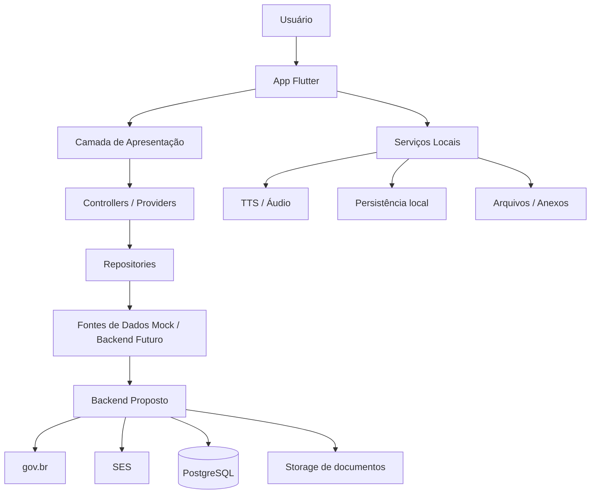
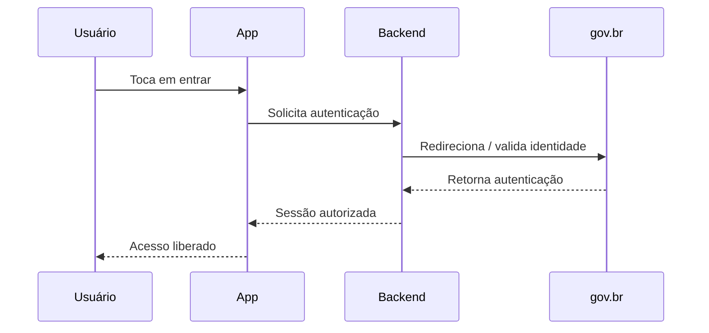
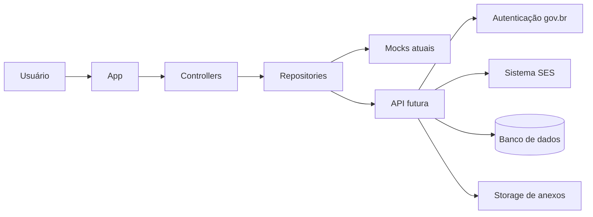

# Arquitetura da Solução — MinhaFila Saúde

## 1. Objetivo deste documento

Este documento descreve a arquitetura funcional e técnica do **MinhaFila Saúde**, aplicativo Flutter voltado para transparência de filas do SUS, acessibilidade e apoio ao fluxo de validação junto à SES.

O objetivo é registrar:

- a visão geral da solução;
- a arquitetura atual do aplicativo;
- os principais componentes do app;
- o fluxo de dados entre usuário, app e backend proposto;
- as decisões arquiteturais de acessibilidade;
- os pontos de evolução planejados.

> **Escopo atual:** aplicação mobile Flutter com camadas organizadas, navegação declarativa, estado centralizado, recursos de acessibilidade, autenticação mock e fluxos simulados.
>
> **Escopo futuro:** integração real com gov.br, SES, backend institucional, auditoria e conteúdos multimídia ampliados, incluindo Libras.

---

## 2. Visão geral da arquitetura

A solução foi desenhada com foco em:

- **separação de responsabilidades**;
- **facilidade de manutenção**;
- **escalabilidade gradual**;
- **testabilidade**;
- **acessibilidade desde a base**.

A arquitetura atual do app segue uma abordagem em camadas, combinando:

- **Flutter + Dart** no cliente;
- **Riverpod** para gerenciamento de estado;
- **go_router** para navegação declarativa;
- **Repository Pattern** para desacoplamento entre UI e fonte de dados;
- **services** para recursos transversais, como áudio e persistência local.

### Visão macro



---

## 3. Princípios arquiteturais adotados

### 3.1 Organização por responsabilidade
Cada parte do sistema deve ter um papel claro:
- **UI** apresenta;
- **controller/provider** coordena estado;
- **repository** fornece dados;
- **service** executa recursos transversais;
- **models** representam domínio.

### 3.2 Evolução incremental
A solução foi desenhada para evoluir por etapas:
1. MVP com dados mockados;
2. persistência local e acessibilidade;
3. backend intermediário;
4. integrações institucionais reais.

### 3.3 Acessibilidade transversal
Acessibilidade não foi tratada como módulo isolado, mas como parte da arquitetura:
- TTS;
- contraste;
- modo daltônico;
- escala de fonte;
- onboarding acessível;
- base inicial para Libras.

### 3.4 Desacoplamento entre app e SES
O app **não deve acessar diretamente** sistemas institucionais no modelo final.  
A comunicação ideal ocorre por uma **API intermediária segura**, responsável por autenticação, regras de negócio, auditoria e integração.

---

## 4. Stack tecnológica

## 4.1 Aplicação mobile
- **Flutter**
- **Dart**
- **Material Design 3**

## 4.2 Estado e navegação
- **Riverpod**
- **StateNotifier**
- **go_router**

## 4.3 Recursos locais
- **shared_preferences** para persistência de preferências
- **flutter_tts** ou serviço equivalente de leitura por voz
- **image_picker / file_picker** para anexos
- **video_player** para conteúdos locais em Libras
- **flutter_svg** para ícones vetoriais

## 4.4 Integração futura
- **API REST**
- **HTTPS**
- **JSON**
- **Autenticação via gov.br**
- **Integração com sistemas da SES**

---

## 5. Arquitetura interna do app

## 5.1 Camadas principais

### Apresentação
Responsável por:
- telas;
- widgets;
- navegação;
- interação com usuário;
- feedback visual.

Exemplos:
- login;
- dashboard;
- histórico;
- notificações;
- ajustes;
- onboarding de acessibilidade.

### Estado / Controllers
Responsável por:
- controlar estado da interface;
- orquestrar ações;
- integrar UI com repositories e services;
- expor dados reativos.

Exemplos:
- `AccessibilityController`
- `DashboardController`
- `AuthController`

### Domínio
Responsável por:
- modelos de negócio;
- contratos;
- regras sem acoplamento à UI.

Exemplos:
- usuário;
- solicitação em fila;
- histórico;
- notificação;
- anexos;
- estimativa de espera.

### Dados
Responsável por:
- fornecer informações para o app;
- abstrair origem dos dados;
- permitir troca entre mock e backend real.

Exemplos:
- repositories mockados;
- repositórios futuros conectados à API.

### Serviços transversais
Responsável por:
- leitura por voz;
- persistência de preferências;
- seleção de arquivos;
- captura de imagem;
- reprodução de mídia;
- utilitários de acessibilidade.

---

## 5.2 Exemplo de organização por feature

A organização do projeto segue a ideia de **feature first**, combinando domínio, apresentação e dados por contexto funcional.

Exemplo conceitual:

```text
lib/
  app/
    app.dart
    router/
    theme/

  core/
    extensions/
    providers/
    services/
    widgets/

  features/
    auth/
      data/
      domain/
      presentation/

    home/
      data/
      domain/
      presentation/

    validation/
      data/
      domain/
      presentation/
```

> A estrutura real pode variar ao longo da evolução, mas a lógica central é manter cada funcionalidade coesa.

---

## 6. Fluxos principais da aplicação

## 6.1 Autenticação
Atualmente:
- autenticação mockada para demonstração e testes.

No modelo final:
- autenticação via gov.br;
- recebimento de identidade validada;
- criação de sessão segura no backend intermediário.



## 6.2 Consulta da fila
Fluxo atual:
- o app consulta um repositório mockado.

Fluxo futuro:
- o backend obtém dados da SES ou sistema regulador;
- o app recebe posição, status, histórico e notificações;
- a interface apresenta essas informações de forma acessível.

## 6.3 Confirmação do procedimento
O cidadão pode indicar:
- que continua aguardando;
- ou que já realizou o procedimento.

Se informar que já realizou:
- pode anexar foto ou PDF;
- o app altera o status para validação;
- o backend futuro registrará essa ação para análise institucional.

## 6.4 Acessibilidade
O app já contempla fluxo de acessibilidade em múltiplas camadas:
- onboarding inicial;
- ajustes persistidos;
- leitura por voz;
- suporte visual ampliado;
- base de Libras.

---

## 7. Arquitetura de acessibilidade

A acessibilidade foi tratada como um **eixo arquitetural**, e não apenas como detalhe visual.

## 7.1 Preferências persistidas
Atualmente são persistidas localmente preferências como:
- alto contraste;
- modo daltônico;
- leitura automática da posição;
- velocidade da fala;
- escala do texto;
- status de conclusão do onboarding.

### Benefícios
- experiência personalizada desde a reabertura do app;
- consistência visual;
- menor esforço do usuário em cada sessão.

## 7.2 Leitura por voz
Foi criada uma camada de serviço para TTS, usada em:
- posição da fila;
- histórico;
- notificações;
- onboarding de acessibilidade.

### Decisão arquitetural
O TTS foi centralizado em serviço para:
- evitar duplicação;
- manter mesma configuração de velocidade;
- facilitar evolução futura.

## 7.3 Alto contraste e modo daltônico
Esses recursos foram incorporados ao tema global do app.

### Benefícios
- mudança visual consistente;
- menor uso de cores fixas;
- maior aderência a uma arquitetura temática centralizada.

## 7.4 Escala global de texto
A escala de texto é aplicada via `MediaQuery` / `textScaler`, permitindo adaptação em múltiplas telas sem necessidade de alterar cada widget manualmente.

## 7.5 Onboarding inicial de acessibilidade
Ao abrir o app pela primeira vez, o usuário pode:
- configurar preferências;
- ouvir instruções;
- futuramente consumir conteúdo em Libras.

### Motivo da escolha
Essa abordagem reduz fricção inicial e permite personalização logo no primeiro acesso.

## 7.6 Libras
A estratégia de Libras está sendo construída de forma gradativa.

### Direção atual
- botão flutuante no onboarding;
- abertura de conteúdo de boas-vindas em Libras;
- estudo da melhor forma de apresentar avatar ou mídia.

### Evolução sugerida
1. boas-vindas em Libras;
2. explicação de cada recurso do onboarding;
3. ajuda em Libras em fluxos críticos.

---

## 8. Gestão de múltiplos procedimentos

O sistema foi pensado para suportar mais de uma solicitação por usuário, por exemplo:
- consulta em cardiologia;
- ressonância;
- outro procedimento regulado.

### Impacto arquitetural
Cada solicitação precisa ter:
- status próprio;
- posição própria;
- histórico próprio;
- notificação própria;
- eventual fluxo de validação próprio.

Isso reforça a necessidade de um modelo de domínio bem estruturado e de componentes reutilizáveis na UI.

---

## 9. Persistência local

Atualmente, a persistência local é usada principalmente para preferências de acessibilidade.

### Responsabilidades
- salvar configurações do usuário;
- restaurar estado ao abrir o app;
- reduzir dependência de reconfiguração manual.

### Tecnologia
- `shared_preferences`

### Observação
Outros dados, como sessão, último login histórico ou cache de dashboard, podem ser persistidos futuramente em nova fase de evolução.

---

## 10. Backend proposto

Embora o escopo atual esteja centrado no Flutter, a arquitetura final prevê um backend intermediário.

## 10.1 Responsabilidades do backend
- autenticação e sessão;
- integração com gov.br;
- consulta segura à SES;
- regras de fila;
- cálculo de estimativa;
- auditoria;
- recebimento e armazenamento de anexos;
- envio de notificações.

## 10.2 Motivo do backend intermediário
O app não deve conversar diretamente com sistemas institucionais porque isso:
- aumenta acoplamento;
- reduz governança;
- dificulta segurança;
- complica evolução futura.

## 10.3 Stack sugerida para backend
Pode ser implementado futuramente com:
- **Java + Spring Boot**
ou outra stack corporativa equivalente.

### Justificativa
- robustez;
- boa integração institucional;
- organização por módulos;
- facilidade de exposição de API REST.

---

## 11. Banco de dados e armazenamento

## 11.1 Banco relacional
Sugestão:
- **PostgreSQL**

### Armazenaria:
- usuários;
- solicitações;
- históricos;
- notificações;
- validações;
- auditoria;
- preferências sincronizadas futuramente.

## 11.2 Storage de documentos
Sugestão:
- **MinIO**
- ou **Amazon S3**

### Armazenaria:
- laudos em PDF;
- imagens enviadas pelo usuário;
- mídias institucionais;
- futuros conteúdos acessíveis.

---

## 12. Segurança e privacidade

Como a aplicação lida com contexto de saúde, a arquitetura considera:

- autenticação segura;
- tráfego por HTTPS;
- menor exposição possível de dados sensíveis;
- trilha de auditoria futura;
- desacoplamento entre app e sistemas internos;
- governança de anexos.

### Pontos futuros relevantes
- tokens seguros;
- expiração de sessão;
- criptografia em trânsito;
- LGPD;
- mascaramento de dados sensíveis;
- logs institucionais.

---

## 13. Fluxo de dados resumido



---

## 14. Testabilidade

A estrutura adotada favorece testes porque:
- controllers ficam desacoplados da UI;
- repositories podem ser mockados;
- services podem ser isolados;
- regras ficam mais previsíveis.

### Tipos de teste possíveis
- unitários para models e controllers;
- widget tests para fluxos de tela;
- integração futura com mock de backend.

---

## 15. Decisões arquiteturais importantes já tomadas

### Decisão 1 — Flutter como base
Escolhido para permitir:
- Android e iOS com uma única base;
- rapidez de prototipação;
- boa experiência visual;
- suporte a acessibilidade e multimídia.

### Decisão 2 — Riverpod para estado
Escolhido para:
- previsibilidade;
- desacoplamento;
- injeção de dependência;
- boa manutenção.

### Decisão 3 — Acessibilidade integrada ao núcleo
Acessibilidade foi trazida para:
- tema global;
- onboarding;
- serviços;
- preferências persistidas.

### Decisão 4 — MVP com mock + arquitetura preparada
Mesmo com dados simulados, o sistema foi organizado para facilitar evolução para backend real.

---

## 16. Limitações atuais

No estado atual, ainda existem limitações esperadas de um MVP acadêmico:

- autenticação mockada;
- dados de fila simulados;
- integração institucional ainda não realizada;
- Libras ainda em fase inicial;
- TTS em calibração fina;
- persistência concentrada em preferências;
- fluxo multimídia ainda em estabilização.

Esses pontos não invalidam a arquitetura; pelo contrário, mostram uma base pronta para evolução incremental.

---

## 17. Roadmap arquitetural sugerido

### Curto prazo
- estabilizar fluxo multimídia de Libras;
- revisar comportamento do TTS;
- refinar onboarding acessível;
- ampliar persistência local.

### Médio prazo
- persistir sessão;
- criar backend intermediário;
- integrar autenticação real;
- estruturar auditoria e validação institucional.

### Longo prazo
- integração real com SES;
- sincronização de preferências;
- analytics e indicadores;
- conteúdo em Libras por fluxo;
- cálculo avançado de estimativa.

---

## 18. Conclusão

A arquitetura do **MinhaFila Saúde** foi planejada para equilibrar:

- simplicidade de MVP;
- organização técnica;
- acessibilidade;
- capacidade de evolução.

Mesmo sendo uma prova de conceito, a solução já demonstra uma base sólida para:
- uso multiplataforma;
- personalização acessível;
- integração institucional futura;
- crescimento gradual com segurança e governança.

Em termos arquiteturais, o projeto não foi desenhado apenas para “mostrar telas”, mas para sustentar uma evolução real de produto, pesquisa aplicada e possível adoção institucional.
